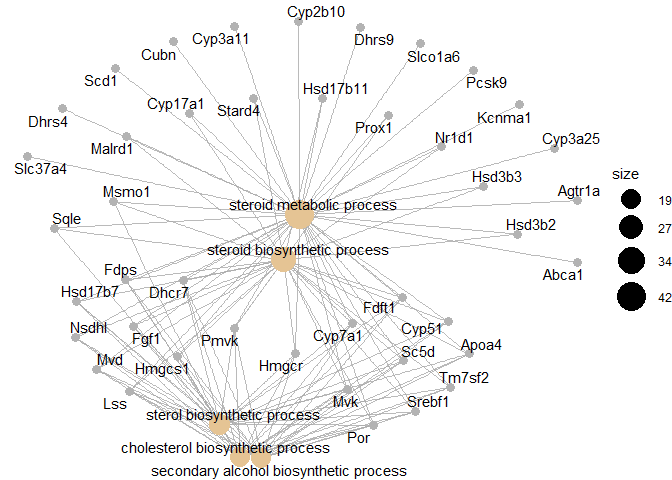
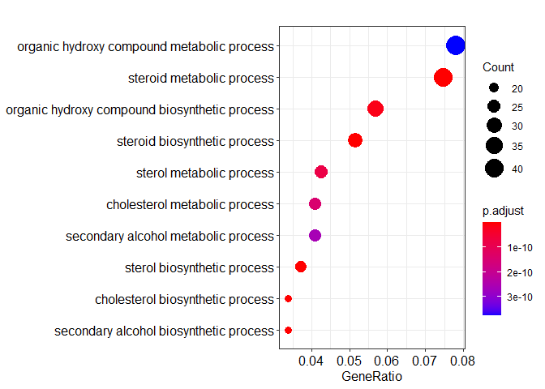

Western Diet Analysis
================

``` r
library(openxlsx)
```

    ## Warning: package 'openxlsx' was built under R version 3.6.3

``` r
library(data.table)
```

    ## Warning: package 'data.table' was built under R version 3.6.3

``` r
library(ggplot2)
```

    ## Warning: package 'ggplot2' was built under R version 3.6.3

``` r
library(magrittr)
library(stringr)
library(clipr)
```

    ## Warning: package 'clipr' was built under R version 3.6.3

    ## Welcome to clipr. See ?write_clip for advisories on writing to the clipboard in R.

``` r
library(limma)
```

    ## Warning: package 'limma' was built under R version 3.6.2

``` r
library(tidyverse)
```

    ## Warning: package 'tidyverse' was built under R version 3.6.3

    ## -- Attaching packages --------------------------------------------------------------------------- tidyverse 1.3.0 --

    ## v tibble  3.0.0     v purrr   0.3.4
    ## v tidyr   1.1.0     v dplyr   1.0.0
    ## v readr   1.3.1     v forcats 0.5.0

    ## Warning: package 'tibble' was built under R version 3.6.3

    ## Warning: package 'tidyr' was built under R version 3.6.3

    ## Warning: package 'readr' was built under R version 3.6.3

    ## Warning: package 'purrr' was built under R version 3.6.3

    ## Warning: package 'dplyr' was built under R version 3.6.3

    ## Warning: package 'forcats' was built under R version 3.6.3

    ## -- Conflicts ------------------------------------------------------------------------------ tidyverse_conflicts() --
    ## x dplyr::between()   masks data.table::between()
    ## x tidyr::extract()   masks magrittr::extract()
    ## x dplyr::filter()    masks stats::filter()
    ## x dplyr::first()     masks data.table::first()
    ## x dplyr::lag()       masks stats::lag()
    ## x dplyr::last()      masks data.table::last()
    ## x purrr::set_names() masks magrittr::set_names()
    ## x purrr::transpose() masks data.table::transpose()

``` r
library(clusterProfiler)
```

    ## Warning: package 'clusterProfiler' was built under R version 3.6.2

    ## 

    ## Registered S3 method overwritten by 'enrichplot':
    ##   method               from
    ##   fortify.enrichResult DOSE

    ## clusterProfiler v3.14.3  For help: https://guangchuangyu.github.io/software/clusterProfiler
    ## 
    ## If you use clusterProfiler in published research, please cite:
    ## Guangchuang Yu, Li-Gen Wang, Yanyan Han, Qing-Yu He. clusterProfiler: an R package for comparing biological themes among gene clusters. OMICS: A Journal of Integrative Biology. 2012, 16(5):284-287.

    ## 
    ## Attaching package: 'clusterProfiler'

    ## The following object is masked from 'package:purrr':
    ## 
    ##     simplify

``` r
library(biomaRt)
```

    ## Warning: package 'biomaRt' was built under R version 3.6.3

``` r
library(org.Mm.eg.db)
```

    ## Loading required package: AnnotationDbi

    ## Loading required package: stats4

    ## Loading required package: BiocGenerics

    ## Loading required package: parallel

    ## 
    ## Attaching package: 'BiocGenerics'

    ## The following objects are masked from 'package:parallel':
    ## 
    ##     clusterApply, clusterApplyLB, clusterCall, clusterEvalQ,
    ##     clusterExport, clusterMap, parApply, parCapply, parLapply,
    ##     parLapplyLB, parRapply, parSapply, parSapplyLB

    ## The following objects are masked from 'package:dplyr':
    ## 
    ##     combine, intersect, setdiff, union

    ## The following object is masked from 'package:limma':
    ## 
    ##     plotMA

    ## The following objects are masked from 'package:stats':
    ## 
    ##     IQR, mad, sd, var, xtabs

    ## The following objects are masked from 'package:base':
    ## 
    ##     anyDuplicated, append, as.data.frame, basename, cbind, colnames,
    ##     dirname, do.call, duplicated, eval, evalq, Filter, Find, get, grep,
    ##     grepl, intersect, is.unsorted, lapply, Map, mapply, match, mget,
    ##     order, paste, pmax, pmax.int, pmin, pmin.int, Position, rank,
    ##     rbind, Reduce, rownames, sapply, setdiff, sort, table, tapply,
    ##     union, unique, unsplit, which, which.max, which.min

    ## Loading required package: Biobase

    ## Welcome to Bioconductor
    ## 
    ##     Vignettes contain introductory material; view with
    ##     'browseVignettes()'. To cite Bioconductor, see
    ##     'citation("Biobase")', and for packages 'citation("pkgname")'.

    ## Loading required package: IRanges

    ## Warning: package 'IRanges' was built under R version 3.6.2

    ## Loading required package: S4Vectors

    ## Warning: package 'S4Vectors' was built under R version 3.6.3

    ## 
    ## Attaching package: 'S4Vectors'

    ## The following objects are masked from 'package:dplyr':
    ## 
    ##     first, rename

    ## The following object is masked from 'package:tidyr':
    ## 
    ##     expand

    ## The following objects are masked from 'package:data.table':
    ## 
    ##     first, second

    ## The following object is masked from 'package:base':
    ## 
    ##     expand.grid

    ## 
    ## Attaching package: 'IRanges'

    ## The following objects are masked from 'package:dplyr':
    ## 
    ##     collapse, desc, slice

    ## The following object is masked from 'package:purrr':
    ## 
    ##     reduce

    ## The following object is masked from 'package:data.table':
    ## 
    ##     shift

    ## The following object is masked from 'package:grDevices':
    ## 
    ##     windows

    ## 
    ## Attaching package: 'AnnotationDbi'

    ## The following object is masked from 'package:dplyr':
    ## 
    ##     select

    ## 

``` r
library(readxl)
```

    ## Warning: package 'readxl' was built under R version 3.6.3

``` r
Western_diet_data <- read_excel("12W_western_silva_2018.xlsx")

Western_diet_data_sig <- Western_diet_data %>%
  filter(FDR < 0.05)
View(Western_diet_data_sig)

western_enztrez= bitr(Western_diet_data_sig$Gene_Symbol, 
                    fromType = "SYMBOL", 
                    toType = "ENTREZID", 
                    OrgDb = "org.Mm.eg.db",
                    drop = T)
```

    ## 'select()' returned 1:1 mapping between keys and columns

    ## Warning in bitr(Western_diet_data_sig$Gene_Symbol, fromType = "SYMBOL", : 10.31%
    ## of input gene IDs are fail to map...

``` r
western_enztrez_bg= bitr(Western_diet_data$Gene_Symbol, 
                      fromType = "SYMBOL", 
                      toType = "ENTREZID", 
                      OrgDb = "org.Mm.eg.db",
                      drop = T)
```

    ## 'select()' returned 1:1 mapping between keys and columns

    ## Warning in bitr(Western_diet_data$Gene_Symbol, fromType = "SYMBOL", toType =
    ## "ENTREZID", : 27.84% of input gene IDs are fail to map...

``` r
goResults_western <- enrichGO(gene = western_enztrez$ENTREZID,
                            universe = western_enztrez_bg$ENTREZID,
                            OrgDb = org.Mm.eg.db,
                            ont = "BP")
goResults_western <- setReadable(goResults_western, OrgDb = org.Mm.eg.db, keyType = "ENTREZID")
```

``` r
cnetplot(goResults_western)
```

<!-- -->

``` r
dotplot(goResults_western)
```

<!-- -->
